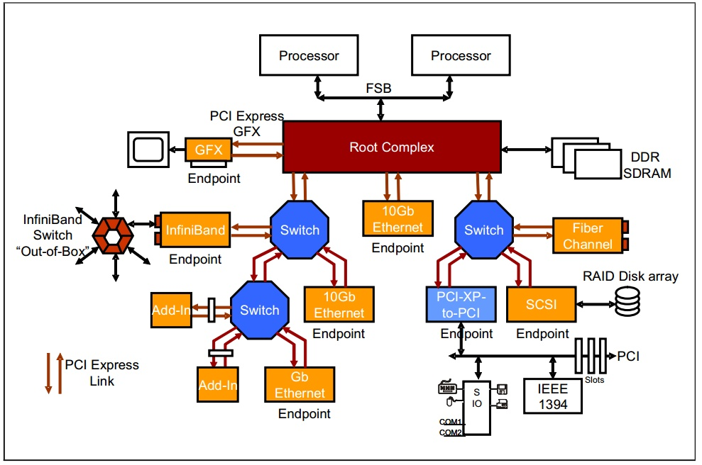

---
layout:
  title:
    visible: true
  description:
    visible: false
  tableOfContents:
    visible: true
  outline:
    visible: true
  pagination:
    visible: true
---

# 🏫 Ch. 2 PCIe Architecture Overview

**PCIe** stands for **Peripheral Component Interconnect Express,** a protocol defining the communications involving **RC-EP, EP-to-EP, EP-to-RC.**

<figure><figcaption></figcaption></figure>

## Root complex (RC)

* Implements CPU interface, Memory interface...etc.

## Endpoint (EP)

* Native PCIe EP
  * Memory mapped device (MMIO).
* Legacy PCIe EP
  * Allows legacy support for IO requests, Locked requests... etc.

## Switch

* Routing device for multiple downstream ports and one upstream port.
