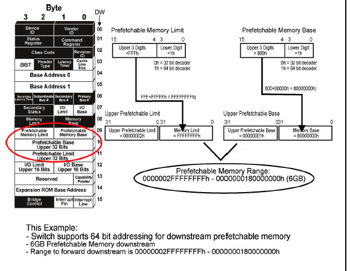
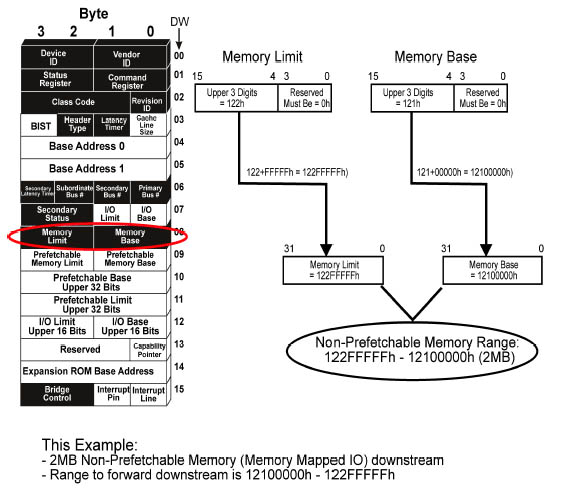
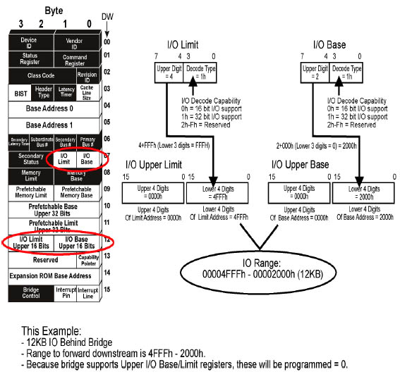

# Base/Limit Registers


Base/Limit Registers is are for **Type 1 headers** only.


## Prefetchable Memory Base/Limit

<figure><figcaption></figcaption></figure>

#### DW9: 32-bit, 64-bit address decoding

* Bits \[3:0]:
  * 0h = 32-bit address decoder
  * 1h = 64-bit address decoder
* Bits \[15:4]
  * **Upper 3 hexadecimal digits** (or 12 bits) for the 32-bit (64-bit) address.

#### DW10-11: Upper 32 bits for 64-bit address


If DW 10-11 Upper Registers are **NOT** implemented, TLP headers mapping to this space can only be 3DW; otherwise it would be 4WD.


***

## Non-Prefetchable Memory Base/Limit

<figure><figcaption></figcaption></figure>

#### DW8, these registers are for non-prefetchable memory (MMIO), which is limited to 32-bit addressing.

* Bits \[3:0]: Reserved and always set to 0
* Bits \[15:4]
  * **Upper 3 hexadecimal digits** (or 12 bits) for the 32-bit address.
* **Lower 5** hexadecimal digits (20 bits) for **Base** are assumed to be **00000h (all 0's).**
* **Lower 5** hexadecimal digits (20 bits) for **Limit** are assumed to be **FFFFFh (all 1's).**


TLP headers mapping to this space can only be 3DW.


***

## IO Base/Limit

<figure><figcaption></figcaption></figure>

#### DW7: 4th hexadecimal digit + decode type

* Bits \[3:0]:
  * 0h = 16-bit addressing
  * 1h = 32-bit addressing
  * 2h-Fh = Reserved
* Bits \[4:7]:
  * **4th hexadecimal digit**

#### DW11: Upper 4 hexadecimal digits

* **Lower 3** hexadecimal digits (12 bits) for **Base** are assumed to be **000h (all 0's).**
* **Lower 3** hexadecimal digits (12 bits) for **Limit** are assumed to be **FFFh (all 1's).**


TLP headers mapping to this space can only be 3DW.

