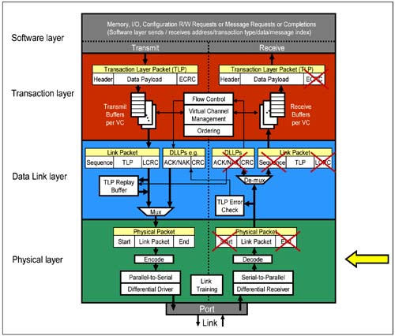

# Device Layers

<figure><figcaption></figcaption></figure>

## Device core / Software layer

* Core functions of the device.

***

## Transaction layer

* TLP Core\*\*: \[Header] - \[Data] - \[ECRC\*\* (Optional)**]**.

***

## Data link layer

* TLP\*\*: \[Sequence ID] - \[TLP Core] - \[LCRC].\*\*
* DLLP: **\[DLLP type] - \[Misc. fields] - \[CRC].**

***

## Physical layer

* TLP and DLLP: **\[Start byte] - \[TLP/DLLP] - \[End byte]**
* PLP (Ordered sets)
