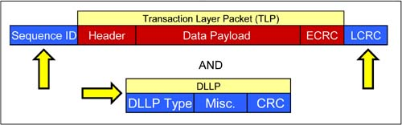

# TLP and DLLP (1)

<figure><figcaption></figcaption></figure>

## TLP (at Data Link Layer):

* Sequence ID is appended first.
* LCRC is calculated based on all bytes in the front, and then appended at the tail.

***

## DLLP:

#### DLLP type:

* ACK
* NAK
* PMx
* FCx

#### Misc. field:

* For ACK/NAK, Sequence ID is stored here.

#### CRC:

* 2 bytes, calculated based on the 4 bytes in the front.

***

### Transmit side:

* Appends sequence ID (12 bit) to the head, LCRC (32 bit) to the tail:\
  **Sequence ID - TLP core section - LCRC.**
* Generates DLLP:\
  **DLLP type - Misc. field - CRC.**

### Receive side:

* Checks for CRC error, and if none, does the work (e.g. strips LCRC and sequence ID from TLP, and forwards the TLP up to the transaction layer, clears replay buffer). If a CRC error is detected, returns back a **NAK DLLP**.
* For a switch, the packet is routed to an egress port based on the header's information. ECRC may be checked/reported, but **ECRC must not be modified**.
* Receive side is responsible for checking the sequence ID of TLP to check for dropped or out-of-order TLPs.
