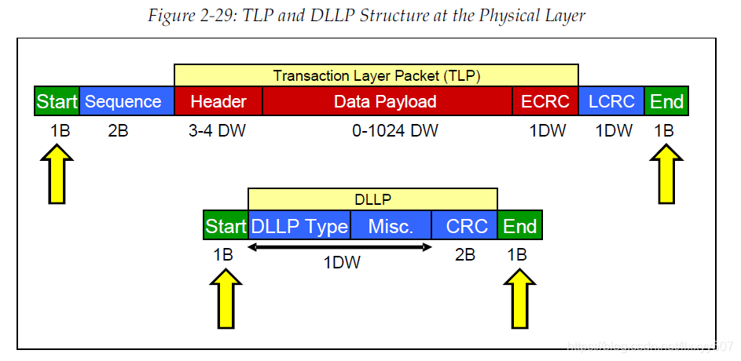

# TLP and DLLP (2)

<figure><figcaption></figcaption></figure>

### Transmit side:

* Appends start byte to the head, end byte to the tail:\
  **Start byte - TLP/DLLP - End byte.**
* Byte striped across available Lanes and scrambled.
* Encodes PLP into a 10b code by **8b/10b logic** (or other for diff. generations).
* Converts PLP **parallel to serial** and **differentially transmits** it on the Link.

### Receive side:

* Converts PLP **serial to parallel**.
* Decode 10b code to 8b
* Strips **Start and End byte off**, and forwards DLLP to the data link layer.
